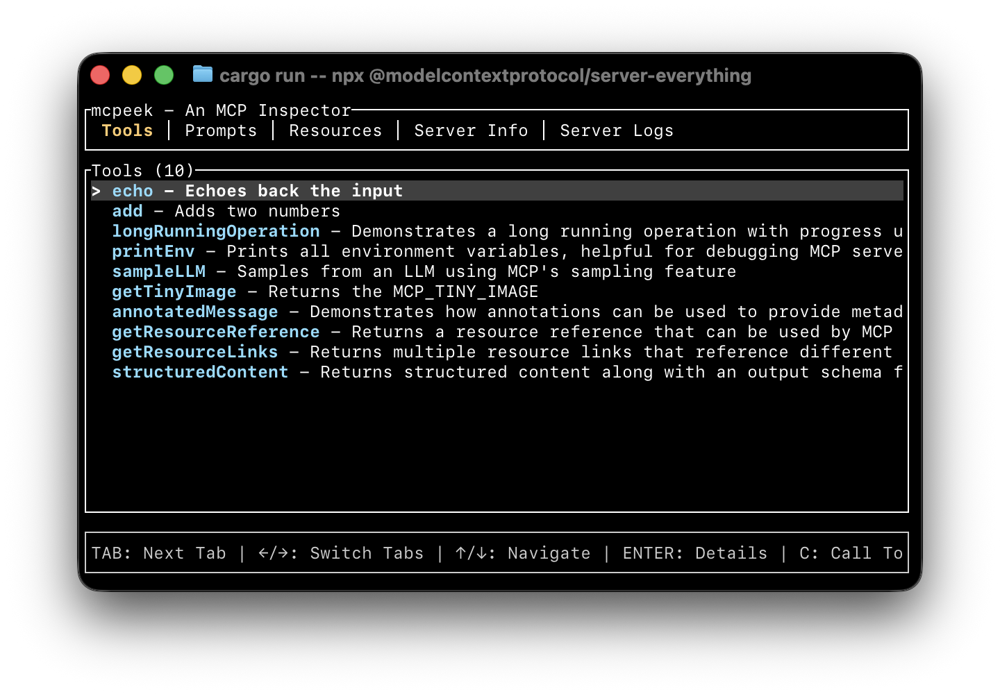

# mcpeek - Protocol Inspector

A Rust CLI tool for inspecting and interacting with Model Context Protocol (MCP) servers and Universal Tool Calling Protocol (UTCP) manuals.



## Features

- **Interactive Terminal User Interface:**
  - Real-time exploration of MCP servers and UTCP manuals
  - Tab-based navigation between different capabilities
  - Live log viewer for server output
  - Identical experience for both MCP and UTCP

- **Full MCP Support:**
  - List and inspect tools
  - **Interactive tool execution with form-based parameter input**
  - Browse prompts and their arguments
  - View available resources
  - Display server capabilities and information
  - Execute tool calls with custom parameters

- **UTCP Manual Support:**
  - Load tool definitions from JSON manual files
  - Execute HTTP and CLI tools directly
  - Environment variable substitution
  - API authentication (API Key, Bearer, Basic)
  - No server subprocess required

## Installation

```bash
cargo build --release
```

The binary will be available at `target/release/mcpeek`.

## Usage

### MCP Mode

Launch the interactive terminal interface to explore an MCP server:

```bash
mcpeek <server-command> [server-args...]
```

**Examples:**

```bash
# Connect to a Node.js MCP server
mcpeek node /path/to/server.js

# Connect to a Python MCP server
mcpeek python -m my_mcp_server

# With uvx
mcpeek uvx mcp-server-git
```

### UTCP Mode

Load and interact with a UTCP manual:

```bash
mcpeek --utcp /path/to/manual.json
```

**Examples:**

```bash
# Load UTCP manual with HTTP tools
mcpeek --utcp tests/fixtures/simple_http.json

# Load UTCP manual with CLI tools
mcpeek --utcp tests/fixtures/cli_tools.json

# With environment variables for authentication
export API_TOKEN="your-token-here"
mcpeek --utcp tests/fixtures/variables.json
```

**TUI Controls:**

- `Tab` / `←/→`: Switch between tabs (Tools, Prompts, Resources, Server Info, Logs)
- `↑/↓`: Navigate items in lists (or scroll logs in Logs tab)
- `Enter`: View detailed information about selected item
- `C`: Call/execute the selected tool (in Tools tab)
- `E`: Jump to end of logs (in Logs tab)
- `R`: Refresh current tab
- `Esc`: Close detail view or cancel tool call input
- `Q`: Quit application

**Tool Calling (in Tools tab):**

When you press `C` on a selected tool:
- An input form appears showing all tool parameters
- Navigate between fields using `Tab` / `Shift+Tab`
- Type values directly into each field
- Required fields are marked as "(required)"
- Press `Enter` to execute the tool call
- Press `Esc` to cancel
- Results are displayed in the detail view

**Tabs:**
- **Tools**: Browse and inspect available tools, execute tool calls with interactive parameter input
- **Prompts**: View prompts and their arguments
- **Resources**: List available resources
- **Server Info**: Display server capabilities and version information
- **Logs**: View server stderr output in real-time (automatically captures server logs)

### Debug Mode

Enable debug logging to stderr:

```bash
mcpeek --debug node server.js
```

## Architecture

```
src/
├── main.rs           # CLI entry point and TUI event loop
├── protocol/         # Shared protocol abstraction
│   └── mod.rs        # ProtocolClient trait and common types
├── mcp/
│   ├── mod.rs        # Module exports
│   ├── client.rs     # MCP client with JSON-RPC over stdio
│   └── protocol.rs   # MCP protocol types and messages
├── utcp/
│   ├── mod.rs        # Module exports
│   ├── client.rs     # UTCP client for manual loading
│   ├── protocol.rs   # UTCP manual types
│   ├── executor.rs   # HTTP and CLI tool execution
│   └── template.rs   # Variable substitution
└── tui/
    ├── mod.rs        # TUI module exports
    ├── app.rs        # Application state management
    └── ui.rs         # UI rendering logic
```

### Key Components

**Protocol Abstraction (`protocol/mod.rs`)**:
- `ProtocolClient` trait implemented by both MCP and UTCP
- Common types for tools, prompts, resources
- Enables protocol-agnostic TUI

**MCP Client (`mcp/client.rs`)**:
- Manages subprocess lifecycle
- Handles JSON-RPC communication over stdio
- Implements async message passing with tokio
- Provides high-level methods for MCP operations

**UTCP Client (`utcp/client.rs`)**:
- Loads tool definitions from JSON manual files
- No subprocess or server required
- Direct HTTP and CLI tool execution

**Tool Executor (`utcp/executor.rs`)**:
- HTTP requests with reqwest (GET, POST, PUT, DELETE, PATCH)
- CLI command execution with tokio::process
- Authentication: API Key, Bearer, Basic
- Variable substitution in URLs and headers

**TUI (`tui/`)**:
- Built with ratatui for rich terminal interfaces
- Tab-based navigation between different capabilities
- Detail views for in-depth item inspection
- Real-time error handling and loading states
- Live log viewer that captures server stderr output

## Protocol Support

### MCP (Model Context Protocol)

This tool implements the MCP protocol version `2024-11-05` and supports:

- ✅ Server initialization and capability negotiation
- ✅ Tools (list, call)
- ✅ Prompts (list, get)
- ✅ Resources (list, read)
- ✅ Server information display

### UTCP (Universal Tool Calling Protocol)

This tool implements UTCP version `1.0.1` and supports:

- ✅ Manual loading from JSON files
- ✅ HTTP tools (GET, POST, PUT, DELETE, PATCH)
- ✅ CLI tools (command execution)
- ✅ Variable substitution (`${VAR_NAME}`)
- ✅ Authentication (API Key, Bearer, Basic)
- ✅ Tool parameter validation
- ✅ Direct tool execution (no server required)

## Requirements

- Rust 2021 edition or later
- An MCP-compatible server to connect to

## Development

Run in development mode:

```bash
# Run the TUI
cargo run -- <server-command> [args...]

# With debug logging
cargo run -- --debug <server-command> [args...]
```

## License

MIT License - see [LICENSE](LICENSE) for details.

## Contributing

Contributions are welcome! Areas for enhancement:

- Support for additional MCP protocol features
- Enhanced error recovery
- Resource subscription support
- Sampling capabilities
- Configuration file support
- Advanced input types (arrays, nested objects) in tool call forms

Made with ❤️. Fueled by ☕️ and 🤖.
